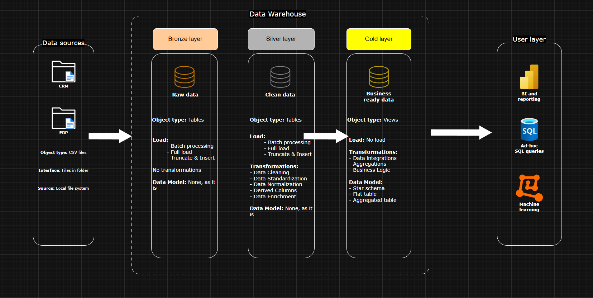
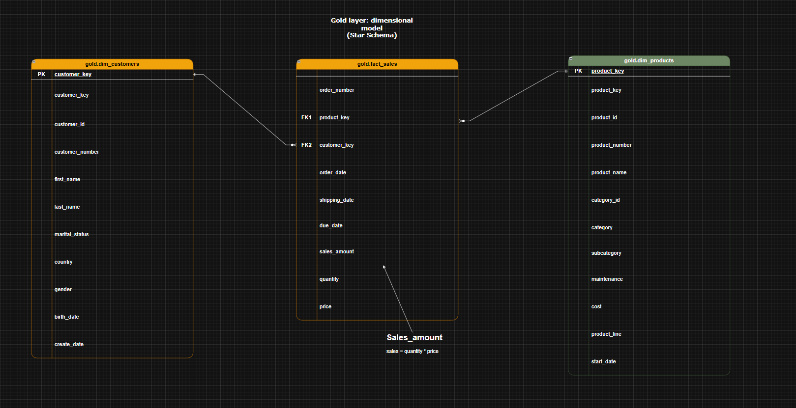

# DataWarehouse project

### **Objective**

Develop a modern data warehouse using SQL server to consolidate sales data, enabling analytical reporting and informed decision-making.

### Specifications

- **Data sources:** Import data from two source systems (ERP and CRM) provided as CSV files
- **Data quality:** Cleanse and resolve data quality issues prior to analysis
- **Integration:** Combine both sources into a single, user friendly data model designed for analytical queries
- **Scope:** Focus on the latest dataset only, historization of data is not required
- **Documentation:** Provide clear documentation of the data model to support both business stakeholders and analytics team.

## BI: analytics and reporting (Data analysis)

**Objective**

Develop SQL based analytics to deliver detailed insights into:

- Customer behavior
- Product performance
- Sales trend

These insights empower stakeholders with key business metrics enabling strategic decision making.

## General principles
**Naming conventions:** For this project I will use snake_case, with lowercase letters and underscores to separate words.

**Language:** English will be the regular language for the project

**Avoid reserved words:** Do not use SQL reserved words as object names

## Table naming convention

### Bronze rules
- All the names must start with the source system name, and table names must match their original names without renaming
- `<sourcesystem>_<entity>`
    - `<sourcesystem>` is the name of the source system, for example crm or erp
    - `<entity>` is the extact table name from the source system
    - Example: crm_customer_info -> customer information from the crm system

### Silver rules
- All the names must start with the source system name, and table names must match their original names without renaming
- `<sourcesystem>_<entity>`
    - `<sourcesystem>` is the name of the source system, for example crm or erp
    - `<entity>` is the extact table name from the source system
    - Example: crm_customer_info -> customer information from the crm system

### Gold rules
- All names must use meaningful table names and should be aligned with the business, starting with the category prefix.
- `<category>_<entity>`
    - `<category>` describes the role of the table (dim or fact)
    - `<entity>` descriptive name of the table, aligned with the business domain, (for example, customers, products, sales)
    - Example:
        - dim_customers -> dimension table for customer data
        - fact_sales -> Fact table containing sales transactions

## Column naming conventions

### Surrogate keys
- All primary keys in dimension tables must use suffix `_key`
- `<table_name>_key`
    - `<table_name>`it refers to the name of the table or entity the key belongs to
    - `_key` suffix indicating that this column is a surrogate key
    - Example: customer_key -> surrogate key in the dim_customers table

### Technical columns
- All technical columns must start with the prefix dwh_, followed by a descriptive name indicating the column purpose
- `dwh_<column_name>`
    - dwh, prefix exclusively for system generated meta data
    - <column_name> descriptive name indicating column purpose
    - example: dwh_load_date -> system generated column used to store the date when the record was loaded.

## Stored procedures
- All stored procedures used for loading data must follow the naming pattern: 
- `load_<layer>`
    - `<layer>` represents the layer being loaded, such as bronze silver or gold.
    - Example:
        - load_bronze -> stored procedure for loading data into the bronze layer
        - load_silver -> stored procedure for loading data into the silver layer

## Data warehouse architecture

The project follows a layered data warehouse architecture:
- **Bronze layer:** Raw data ingestiion form source systems (CRM and ERP)
- **Silver layer:** Data cleansing, standardization and integration
- **Gold layer:** Business ready dimensional moder oprimized for analytical queries

## Dimensional data model

The analytical layer follows a start schema design.

The fact table stores transactional sales data while dimensiontables provide descriptive attributes used for filtering and aggregations.

Fact table:
- Fact sales

Dimension tables:
- dim_customers
- dim_products

## ETL pipeline

Data is processed through three stages:

1. **Extraction**
    - Source CSV files from ERP and CRM systems

2. **Transformation**
    - Data cleaning
    - Standardization
    - Integration between sources

3. **Loading**
    - Data loaded into bronze, silver layers using stored procedures

## Analytical SQL queries

The project inludes analytical queries designed to extract business insights from the data warehouse:

Examples include:
- Customer segmentation
- Sales trend over time
- Product performance analysis
- Magnitude and raking analysis

## Repository structure

- datasets/     -- raw source data
- scripts/      -- ETL scripts and analytial queries
- documents/    -- architecture and data model diagrams
- tests/        -- data quality checks
